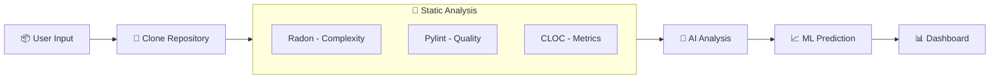

<p align="center">
  <h1 align="center">🔍 DevPulse</h1>
  <p align="center"><strong>Predictive Code Health & Technical Debt Intelligence Platform</strong></p>
  <p align="center">
    <a href="#-features">Features</a> •
    <a href="#-workflow">Workflow</a> •
    <a href="#-architecture">Architecture</a> •
    <a href="#-quick-start">Quick Start</a> •
    <a href="#-api-reference">API</a>
  </p>
</p>

---

DevPulse is a production-grade code analysis and risk forecasting engine that combines **static analysis**, **ML-based risk modeling**, and **LLM-powered reasoning** inside a hardened, containerized architecture. It provides an end-to-end system for quantifying, visualizing, and predicting technical debt.

> **Designed for:** Systems Engineers, ML Engineers, Full-Stack Developers, and DevOps professionals seeking to demonstrate real-world engineering capabilities in security, scalability, and interpretability.

---

## 📊 Features

| Feature | Description |
|---------|-------------|
| **Code Health Score (CHS)** | Unified 0-100 score combining multiple quality signals |
| **Static Analysis** | Pylint, Radon (complexity), CLOC (lines of code) analysis |
| **AI Code Detection** | LLM-powered detection of AI-generated code patterns |
| **Predictive Risk** | ML model forecasting future technical debt probability |
| **Secure Sandbox** | Docker-isolated analysis of untrusted repositories |
| **Real-time Dashboard** | React-based visualization with interactive charts |
| **Report Persistence** | SQLite database for historical analysis tracking |

---

## 🎥 Demo

Check out DevPulse in action:

[](https://drive.google.com/file/d/1jU8g6ZRCIUHYgJJ1-H4a81JvSdwz1_g1/view?usp=drive_link)

---

## 🔄 Workflow

The DevPulse analysis pipeline follows a structured 6-step workflow:



### Step-by-Step Process

#### **1. Repository Input**
- User submits a GitHub repository URL via the React frontend
- Request is sent to FastAPI backend at `/analyze` endpoint

#### **2. Repository Cloning**
```
backend/utils/repo_downloader.py → clone_repo()
```
- Repository is cloned to a temporary directory
- Git SHA is captured for version tracking
- Supports both public and private repositories (with PAT)

#### **3. Static Analysis (Concurrent)**
All three tools run in parallel using `asyncio.gather()`:

| Tool | Purpose | Output |
|------|---------|--------|
| **Radon** | Cyclomatic complexity analysis | Average complexity, function count, complexity blocks |
| **Pylint** | Code quality scoring | Score (0-10), issues list, recommendations |
| **CLOC** | Lines of code metrics | Code lines, comment lines, blank lines, language distribution |

#### **4. AI-Powered Analysis**
```
backend/services/ai_summary.py → generate_ai_metrics()
```
- Sends analysis outputs to LLM (Groq/OpenAI)
- Detects AI-generated code patterns:
  - Excessive boilerplate comments
  - Token-like variable names
  - Non-idiomatic structures
  - LLM verbosity in docstrings
- Returns: `ai_probability` (0.0-1.0), `ai_risk_notes`, `recommendations`

#### **5. ML Risk Prediction**
```
backend/services/predictor.py → get_historical_risk_score()
```
Feature vector (6 dimensions):
1. Normalized Pylint Score (0-1)
2. AI Code Probability (0-1)
3. Normalized Code Lines (log-scale)
4. Normalized Average Complexity
5. Comment Ratio
6. Complexity Density (complexity per 100 LOC)

**Model:** Ridge Regression (`ml/historical_risk_model.joblib`)

#### **6. Code Health Score Calculation**
```python
CHS = (Pylint × 0.45) - (AI_Risk × 0.25) - (Historical_Risk × 0.20) - (Complexity × 0.10) + Documentation_Bonus
```

Final score is scaled to 0-100 range.

---

## 🏗️ Architecture

```
┌─────────────────────────────────────────────────────────────────────┐
│                        DevPulse Architecture                         │
├─────────────────────────────────────────────────────────────────────┤
│                                                                       │
│  ┌─────────────┐     ┌─────────────────────────────────────────────┐ │
│  │   React     │────▶│            FastAPI Backend                  │ │
│  │  Frontend   │◀────│  ┌─────────┐ ┌─────────┐ ┌───────────────┐  │ │
│  │  (Port 3000)│     │  │Analyzer │ │Predictor│ │  AI Summary   │  │ │
│  └─────────────┘     │  └────┬────┘ └────┬────┘ └───────┬───────┘  │ │
│                      │       │           │              │          │ │
│                      │  ┌────▼───────────▼──────────────▼────────┐ │ │
│                      │  │              SQLite DB                 │ │ │
│                      │  │            (devpulse.db)               │ │ │
│                      │  └────────────────────────────────────────┘ │ │
│                      └─────────────────────────────────────────────┘ │
│                                        │                             │
│                                        ▼                             │
│  ┌─────────────────────────────────────────────────────────────────┐ │
│  │              Docker Sandbox Container                           │ │
│  │  ┌─────────┐ ┌─────────┐ ┌─────────┐ ┌─────────────────────┐   │ │
│  │  │  Radon  │ │ Pylint  │ │  CLOC   │ │  Git (repo clone)   │   │ │
│  │  └─────────┘ └─────────┘ └─────────┘ └─────────────────────┘   │ │
│  │                                                                 │ │
│  │  🔒 Security: Non-root • Read-only mounts • No network         │ │
│  │              Memory-limited (512MB) • Ephemeral containers     │ │
│  └─────────────────────────────────────────────────────────────────┘ │
│                                                                       │
│  ┌─────────────────────────────────────────────────────────────────┐ │
│  │                    External Services                            │ │
│  │  ┌─────────────────┐     ┌─────────────────────────────────┐   │ │
│  │  │   Groq API      │     │   OpenAI API (fallback)         │   │ │
│  │  │   (LLM)         │     │                                 │   │ │
│  │  └─────────────────┘     └─────────────────────────────────┘   │ │
│  └─────────────────────────────────────────────────────────────────┘ │
└─────────────────────────────────────────────────────────────────────┘
```

### Component Details

| Component | Technology | Responsibility |
|-----------|------------|----------------|
| **Frontend** | React 18, CSS | User interface, real-time visualization |
| **Backend** | FastAPI, Python 3.11 | API routing, orchestration, business logic |
| **Analyzer** | asyncio, subprocess | Concurrent tool execution |
| **Predictor** | scikit-learn, joblib | ML model loading and prediction |
| **AI Service** | httpx, Groq/OpenAI | LLM integration for AI code detection |
| **Database** | SQLite | Report persistence and history |
| **Sandbox** | Docker | Secure isolated code analysis |

---

## 🔐 Security Model

DevPulse treats every analyzed repository as **potentially hostile**:

| Security Feature | Implementation |
|-----------------|----------------|
| **Container Isolation** | Analysis runs in ephemeral Docker containers |
| **Read-only Mounts** | Repository mounted as read-only (`mode: 'ro'`) |
| **Resource Limits** | Memory capped at 512MB, CPU limited |
| **Network Isolation** | `network_mode: none` - no external access |
| **Non-root Execution** | Containers run with reduced privileges |
| **Automatic Cleanup** | Containers destroyed after each analysis |

---

## 🚀 Quick Start

### Prerequisites

- Docker Desktop (with Docker Compose)
- Python 3.11+
- Node.js 18+
- Git

### Installation

```bash
# Clone the repository
git clone https://github.com/devika-sajeesh/DevPulse.git
cd DevPulse

# Configure environment variables
cp .env.example .env
# Edit .env with your API keys:
# - GROQ_API_KEY (or OPENAI_API_KEY)
# - GITHUB_PAT (for private repos)

# Train the ML model
python ml/train_model.py

# Start the backend with Docker
docker compose up --build -d

# Start the frontend (in separate terminal)
cd frontend
npm install
npm start
```

### Access Points

| Service | URL |
|---------|-----|
| **Frontend Dashboard** | http://localhost:3000 |
| **Backend API** | http://localhost:8000 |
| **API Documentation** | http://localhost:8000/docs |

---

## 📡 API Reference

### Endpoints

| Method | Endpoint | Description |
|--------|----------|-------------|
| `POST` | `/analyze` | Analyze a GitHub repository |
| `GET` | `/reports` | List all analysis reports |
| `GET` | `/reports/{id}` | Get specific report by ID |
| `GET` | `/status` | Health check |
| `GET` | `/debug-tools` | Debug tool availability |

### Example: Analyze Repository

```bash
curl -X POST http://localhost:8000/analyze \
  -H "Content-Type: application/json" \
  -d '{"repo_url": "https://github.com/user/repo"}'
```

**Response:**
```json
{
  "report_id": 1,
  "results": {
    "repo_url": "https://github.com/user/repo",
    "git_sha": "abc123...",
    "code_health_score": 72.5,
    "historical_risk_score": 0.25,
    "pylint": { "score": 7.8, "issues": [...] },
    "radon": { "average_complexity": 3.2, "total_functions": 45 },
    "cloc": { "code": 1250, "comment": 180, "blank": 95 },
    "ai_metrics": {
      "ai_probability": 0.15,
      "ai_risk_notes": "Low AI indicators detected",
      "recommendations": [...]
    }
  }
}
```

---

## 📁 Project Structure

```
DevPulse/
├── backend/
│   ├── main.py                 # FastAPI application & routes
│   ├── config.py               # Configuration management
│   ├── services/
│   │   ├── analyzer.py         # Repository analysis orchestration
│   │   ├── predictor.py        # ML model & CHS calculation
│   │   ├── ai_summary.py       # LLM integration for AI detection
│   │   └── db_service.py       # SQLite database operations
│   ├── utils/
│   │   ├── repo_downloader.py  # Git repository cloning
│   │   ├── radon_parser.py     # Radon output parsing
│   │   ├── cloc_parser.py      # CLOC output parsing
│   │   ├── pylint_parser.py    # Pylint output parsing
│   │   ├── validators.py       # Input validation
│   │   ├── exceptions.py       # Custom exception classes
│   │   └── logger.py           # Logging configuration
│   └── tests/                  # Unit and integration tests
├── frontend/
│   ├── src/
│   │   ├── App.jsx             # Main application component
│   │   ├── components/
│   │   │   ├── RepoForm.jsx           # Repository input form
│   │   │   ├── CodeHealthGauge.jsx    # CHS visualization
│   │   │   ├── PredictiveMetricsCard.jsx  # Risk metrics display
│   │   │   ├── ComplexityChart.jsx    # Complexity visualization
│   │   │   ├── AnalysisTabs.jsx       # Tabbed analysis view
│   │   │   ├── AISummaryCard.jsx      # AI analysis display
│   │   │   ├── PylintBadge.jsx        # Quality score badge
│   │   │   └── Header.jsx             # Application header
│   │   └── api/
│   │       └── api.js          # API client utilities
│   └── public/
├── ml/
│   ├── train_model.py          # ML model training script
│   └── historical_risk_model.joblib  # Trained model file
├── Dockerfile                  # Backend container definition
├── Dockerfile.sandbox          # Secure analyzer container
├── docker-compose.yml          # Multi-container orchestration
├── requirements.txt            # Python dependencies
├── pyproject.toml              # Project configuration
└── README.md
```

---

## 🧠 Machine Learning Details

### Model Architecture

| Aspect | Details |
|--------|---------|
| **Algorithm** | Ridge Regression (L2 regularization) |
| **Features** | 6-dimensional feature vector |
| **Target** | Technical debt probability (0-1) |
| **Regularization** | α = 0.1 |

### Feature Engineering

```python
features = [
    pylint_score / 10.0,              # Quality (0-1)
    ai_probability,                    # AI risk (0-1)
    log(1 + lines) / log(10001),      # Size (log-normalized)
    avg_complexity / 20.0,             # Complexity (0-1)
    comments / code_lines,             # Documentation ratio
    total_complexity / lines * 100     # Complexity density
]
```

### Training

```bash
python ml/train_model.py
```

Output metrics include R² score, feature weights with interpretation, and sample predictions.

---

## 🧪 Testing

### Run Tests

```bash
# Backend unit tests
cd backend
pytest tests/ -v

# Frontend tests
cd frontend
npm test
```

### Test Coverage

```bash
pytest --cov=backend tests/
```

---

## 🌱 Roadmap

### Completed ✅
- [x] FastAPI backend with async analysis
- [x] Docker containerized sandbox
- [x] ML-based risk prediction
- [x] LLM integration for AI code detection
- [x] React dashboard with visualizations
- [x] SQLite report persistence

### In Progress 🔄
- [ ] Seccomp-hardened sandbox profile
- [ ] Concurrency control & job queue
- [ ] Expand ML model (Random Forest, XGBoost)

### Planned 📋
- [ ] Multi-language support (JavaScript, Go, Java)
- [ ] Trend analysis dashboard
- [ ] CI/CD integration (GitHub Actions)
- [ ] Fine-tuned domain-specific LLM
- [ ] Public evaluation dataset

---

## 🤝 Contributing

Contributions are welcome! Please feel free to submit a Pull Request.

1. Fork the repository
2. Create your feature branch (`git checkout -b feature/AmazingFeature`)
3. Commit your changes (`git commit -m 'Add some AmazingFeature'`)
4. Push to the branch (`git push origin feature/AmazingFeature`)
5. Open a Pull Request

---

## 📜 License

This project is licensed under the MIT License - see the [LICENSE](LICENSE) file for details.

---

## 👩‍💻 Author

**Devika Sajeesh**  
B.Tech (EL), College of Engineering Trivandrum

[](https://linkedin.com/in/devika-sajeesh)
[](https://github.com/devika-sajeesh)

---

<p align="center">
  <sub>DevPulse represents a practical, deeply engineered demonstration of secure ML systems—combining real-world software engineering, runtime isolation, predictive modeling, and modern LLM reasoning.</sub>
</p>
